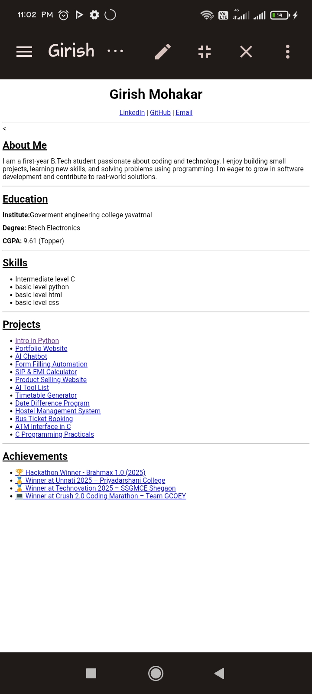

# 💼 Girish Mohakar - Resume

---

## 📚 Table of Contents
- [🧑‍💻 About Me](#-about-me)
- [🎓 Education](#-education)
- [💡 Skills](#-skills)
- [📁 Projects](#-projects)
- [🏆 Achievements](#-achievements)
- [📸 Screenshots](#-screenshots)
- [📫 Contact](#-contact)

---

## 🧑‍💻 About Me

I am a **first-year B.Tech Electronics** student passionate about coding and technology.  
I love to build small projects, learn new tools, and solve real-world problems through programming.

---

## 🎓 Education

- **Institute:** Government Engineering College, Yavatmal  
- **Degree:** B.Tech in Electronics  
- **CGPA:** 9.61 _(Topper)_

---

## 💡 Skills

- ✅ C Programming - Intermediate
- ✅ Python - Basic
- ✅ HTML - Basic
- ✅ CSS - Basic

---

## 📁 Projects

| Project | Link |
|--------|------|
| Intro in Python | [🔗 GitHub](https://github.com/girishmohakar/Intro-in-python) |
| Portfolio Website | [🔗 GitHub](https://github.com/girishmohakar/Portfolio-) |
| AI Chatbot | [🔗 GitHub](https://github.com/girishmohakar/Ai-chatbot) |
| Form Filling Automation | [🔗 GitHub](https://github.com/girishmohakar/Form_filling) |
| SIP & EMI Calculator | [🔗 GitHub](https://github.com/girishmohakar/Sip-and-emi-calculator-) |
| Product Selling Website | [🔗 GitHub](https://github.com/girishmohakar/Product_selling-website) |
| AI Tool List | [🔗 GitHub](https://github.com/girishmohakar/Ai-tool_list) |
| Timetable Generator | [🔗 GitHub](https://github.com/girishmohakar/Timetable-) |
| Date Difference Program | [🔗 GitHub](https://github.com/girishmohakar/Date_diff-program-) |
| Hostel Management System | [🔗 GitHub](https://github.com/girishmohakar/Hostel_management_system-) |
| Bus Ticket Booking | [🔗 GitHub](https://github.com/girishmohakar/Bus_ticket-) |
| ATM Interface in C | [🔗 GitHub](https://github.com/girishmohakar/Atm_interface) |
| C Programming Practicals | [🔗 GitHub](https://github.com/girishmohakar/Practicals-) |

---

## 🏆 Achievements

- 🏆 [Hackathon Winner - Brahmax 1.0 (2025)](https://www.linkedin.com/posts/girish-mohakar-96b9ab257_teamgcoey-bramax1abr0-hackathonjourney-activity-7332132367551160320-Cqwm)
- 🥇 [Winner at Unnati 2025 – Priyadarshani College](https://www.linkedin.com/posts/girish-mohakar-96b9ab257_engineering-gratitude-learning-activity-7313230297502793729-h_yJ)
- 🏅 [Winner at Technovation 2025 – SSGMCE Shegaon](https://www.linkedin.com/posts/girish-mohakar-96b9ab257_exciting-experience-at-technovation-2025-activity-7303837006667595776-zXuR)
- 💻 [Winner at Crush 2.0 Coding Marathon – Team GCOEY](https://www.linkedin.com/posts/girish-mohakar-96b9ab257_crush2abr0-teamgcoey-cprogramming-activity-7332135407087693824-a1MN)

---

## 📸 Screenshots

---

## 📫 Contact

- 📧 **Email:** [girishmohakarentc@.com](mailto:girishmohakarentc@.com)  
- 🔗 **LinkedIn:** [linkedin.com/in/girish-mohakar](https://www.linkedin.com/in/girish-mohakar-96b9ab257)  
- 💻 **GitHub:** [github.com/girishmohakar](https://github.com/girishmohakar)

---

> 📌 _Feel free to fork, explore, and connect with me!_
